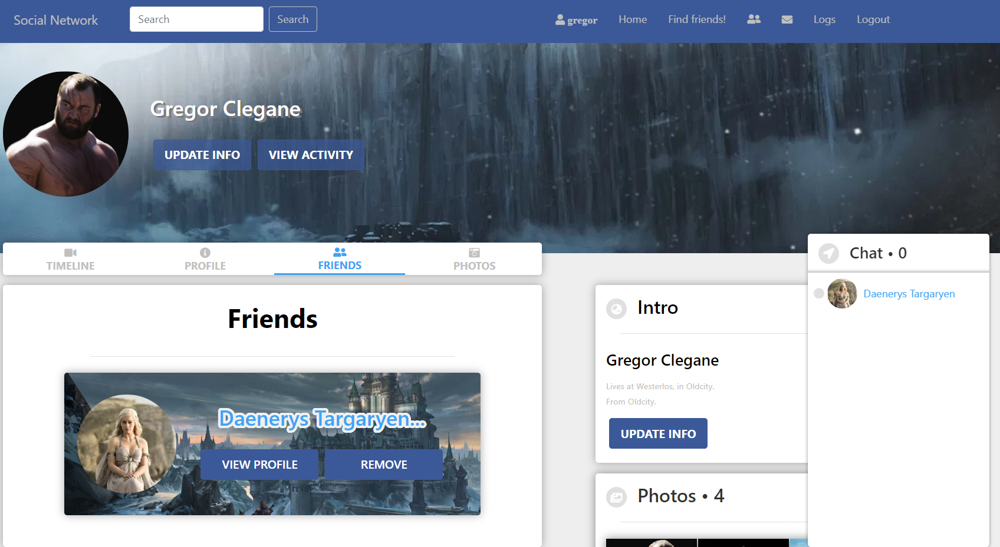
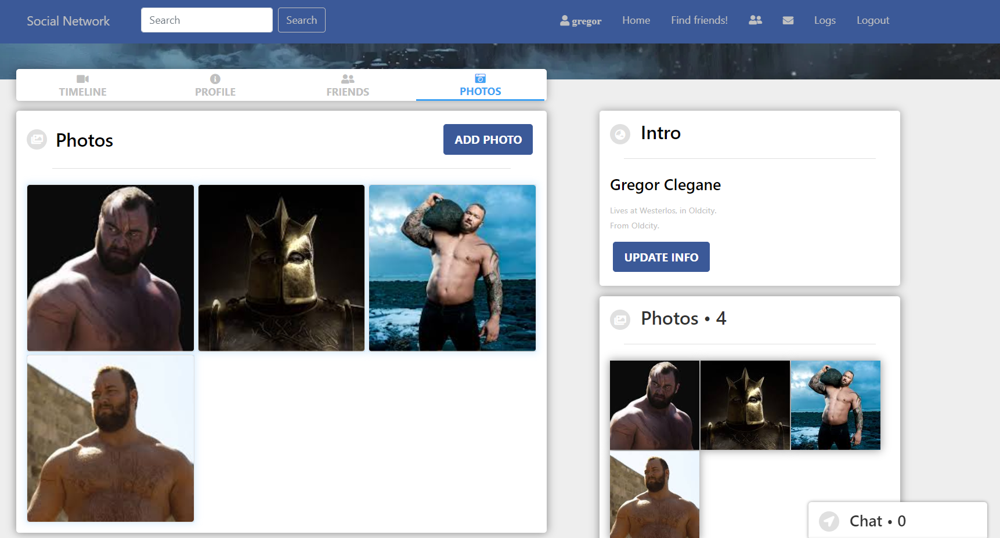

# Social-Network Cloud Architecture

Social-Network is a stateful social networking application designed with scalability, performance, and reliability in mind. This project demonstrates the deployment of the application on the cloud using AWS services, adhering to the AWS Well-Architected Framework. The application backend is built with **Spring Boot**, the frontend with **React**, and the database is managed using **MySQL**.

---

## Project Overview

The Social-Network application offers the following features:

- **User Management**: Registration, login, logout, and role-based access control (Root, Admin, User).
- **Social Interactions**: Friend requests, chatting, posting, and commenting.
- **Media Management**: Uploading and managing photos.
- **Logs and History**: Track user actions.

This architecture focuses on leveraging cloud services to enhance the scalability, reliability, and security of the application. It also implements CI/CD pipelines for seamless updates and deployments.

---

## Features

### Application Features

- User authentication and role-based access using **AWS Cognito**.
- Dynamic content management with **Spring Boot** and **React**.
- Real-time notifications with **AWS SNS**.
- Messaging and asynchronous tasks managed via **AWS SQS**.
- Scalable storage of user data and media using **Amazon S3**.

### Architectural Features

- **Compute**:
  - Application servers deployed on **EC2** instances behind an **Auto Scaling Group** to ensure high availability and fault tolerance.
  - Frontend served via **CloudFront** for fast and secure content delivery.
- **Networking**:
  - Enforced security via **VPC** with public and private subnets.
  - **Application Load Balancer** for routing and distributing traffic.
- **Database**:
  - MySQL database hosted on **Amazon RDS**, optimized for multi-AZ deployments.
  - Credentials securely managed using **AWS Secrets Manager**.
- **Serverless Components**:
  - **AWS Lambda** for processing background tasks.
  - **API Gateway** for efficient and scalable API management.
- **Monitoring and Logging**:
  - Application metrics and logs managed using **Amazon CloudWatch**.
  - Audit trails captured via **AWS CloudTrail**.

---

## Architecture Diagram


---

## AWS Well-Architected Framework Alignment

### 1. Operational Excellence

- Automated deployments using CI/CD pipelines.
- Centralized monitoring and logging with **Amazon CloudWatch** and **CloudTrail**.

### 2. Security

- Secure user authentication with **AWS Cognito**.
- Encrypted storage for sensitive data using **Amazon S3** and **RDS**.
- Access control via **IAM Roles** and **Security Groups**.

### 3. Reliability

- High availability with **Auto Scaling** and **multi-AZ deployments** for RDS.
- Reliable messaging with **AWS SQS** and **SNS**.

### 4. Performance Efficiency

- Caching with **CloudFront** to reduce latency.
- Optimized database queries for faster data retrieval.

### 5. Cost Optimization

- Cost-effective resource allocation using **Auto Scaling**.
- Serverless components (**Lambda**, **API Gateway**) for on-demand resource utilization.

---

## Technologies Used

### Cloud Services

- **AWS Services**: EC2, RDS, S3, VPC, Lambda, API Gateway, CloudFront, Cognito, SQS, SNS, CloudWatch, CloudTrail, Secrets Manager

### Application Frameworks

- **Backend**: Spring Boot
- **Frontend**: React
- **Database**: MySQL

---

## Deployment Instructions

### Pre-requisites

- AWS account with sufficient permissions.
- Docker installed locally for testing containerized builds.
- CI/CD pipeline set up (e.g., AWS CodePipeline or Jenkins).

### Deployment Steps

1. Clone the repository:

   ```bash
   git clone https://github.com/Jemspatel007/socialnetwork
   ```

2. Configure AWS credentials locally.

3. Deploy the infrastructure using **CloudFormation**:

   ```bash
   aws cloudformation deploy
   ```

4. Monitor the application using **CloudWatch** and validate the deployment.

---

## Screenshots

### Home Page:


### Friend Management Page:



### Photos Page:



---

## Challenges & Learnings

- **Challenge**: Managing stateful applications on a scalable architecture. **Solution**: Used Amazon RDS with multi-AZ deployments and S3 for externalized media storage.

- **Challenge**: Ensuring secure and seamless authentication. **Solution**: Integrated AWS Cognito with role-based access control.

- **Challenge**: Balancing cost with performance. **Solution**: Leveraged Auto Scaling Groups and serverless components for on-demand scaling.

---

## Conclusion & Future Enhancements

This project demonstrates a scalable and secure cloud architecture that adheres to best practices outlined in the AWS Well-Architected Framework. Future enhancements include:

- Adding CI/CD pipelines for automated testing and deployment.
- Implementing advanced analytics with **Amazon Athena**.
- Expanding support for multi-region deployments.

---

## Contact

For questions or contributions, please contact: **Jems Patel**\
Email: [jems007patel@gmail.com](mailto\:jems007patel@gmail.com)\
GitHub: [Jemspatel007](https://github.com/Jemspatel007)
